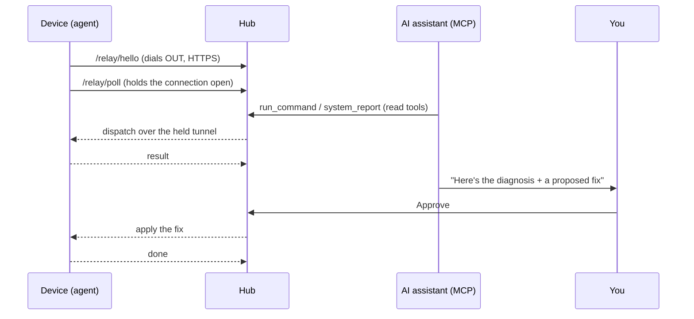

# IT-AI — 5-Minute Self-Host Quickstart

Stand up a hub, enroll one device, ask the AI to diagnose it, and approve your first
fix — all in under five minutes, on your own infrastructure. No cloud account, no
inbound firewall holes.

IT-AI is a self-hosted, open-source (AGPL-3.0) IT-management tool: a single lightweight
Rust endpoint agent, a reverse-tunnel hub, and a 30-tool MCP server that lets an AI
inspect machines autonomously and fix them only with your approval.

---

## The shape of it

```
                    outbound HTTPS (long-poll)          you (browser / AI)
   ┌───────────┐   ──────────────────────────►   ┌──────────────────────┐
   │  agent    │        the device dials OUT      │        hub           │
   │ (device)  │ ◄──────────────────────────────  │  dashboard + /m MCP  │
   │  IT-AI    │     hub drives it back down       │   it-ai-hub          │
   └───────────┘         the same channel          └──────────┬───────────┘
   no inbound ports                                           │  /m (MCP)
   no public address                                          ▼
                                                    ┌──────────────────────┐
                                                    │  AI assistant (MCP)  │
                                                    │  inspect · propose   │
                                                    │  fix → YOU approve   │
                                                    └──────────────────────┘
```

Or, as a sequence:



**Why there are zero inbound ports.** The device runs the agent in *relay mode*: it makes
an **outbound** HTTPS connection to the hub and holds it open (an HTTP long-poll on the
hub's normal port — `/relay/hello`, `/relay/poll`, `/relay/reply`; no extra port, no
WebSocket). Every action — screenshot, live screen, shell, file transfer, update — rides
that one connection: the hub pushes a request down the held channel, the agent serves it
against its own loopback server and streams the result back. The device never needs a
public address or an open inbound port, so it works across NAT and from a cloud-hosted
hub without touching the endpoint's firewall.

---

## Step 1 — deploy the hub (one command)

The hub is a single ~3 MB static Rust binary. Pick either path.

**From a release binary** (no build toolchain needed):

```bash
# download the hub for your platform, then run it
chmod +x it-ai-hub-macos
HUB_DATA=./hub-data RELAY_TOKEN="$(openssl rand -hex 32)" ./it-ai-hub-macos
```

**Or build from source** (Rust workspace, all four binaries):

```bash
cargo build --release          # binaries land in target/release/
HUB_DATA=./hub-data RELAY_TOKEN="$(openssl rand -hex 32)" ./target/release/it-ai-hub
```

The hub prints its dashboard URL and the ID/relay commands, e.g.:

```
Mac ID:    itays-macbook-pro
Dashboard: http://localhost:8770/
```

Open the dashboard. `HUB_DATA` is where everything persistent lives (enrollment tokens,
schedules, recordings, plugins, owner assignments) — point it at a writable volume.

> **Set `RELAY_TOKEN` from the start.** With it set, the hub runs in *strict ownership*
> mode: every device is owned from birth, enrollment requires a personal token, and each
> authenticated user sees and drives only their own devices. Leaving it unset is the
> open trusted-LAN/dev path. See [SECURITY.md](SECURITY.md).

For an internet-reachable hub behind a TLS-terminating proxy (e.g. AppCrane), also set
`HUB_PUBLIC_URL=https://your-hub.example.com` so the dashboard shows ready-made relay
install commands. The agent-facing paths (`/relay`, `/bin`, and `/m` if you use the MCP)
are SSO-bypassed and authenticated by the token instead; keep `/x/*` — the human control
surface — behind SSO.

---

## Step 2 — enroll a device with a personal token

In the dashboard, open **+ Add device / Register a device**. It mints a personal
enrollment token (`htok_…`) scoped to your account and shows a ready-to-paste, per-OS
command with a copy button. It looks like this:

```bash
# macOS / Linux
curl -L -o it-ai https://your-hub.example.com/bin/it-ai-macos && chmod +x it-ai
./it-ai --relay https://your-hub.example.com --relay-token htok_YOURTOKEN --name my-laptop
```

```powershell
# Windows (PowerShell)
curl.exe -L -o it-ai.exe https://your-hub.example.com/bin/it-ai-windows.exe
.\it-ai.exe --relay https://your-hub.example.com --relay-token htok_YOURTOKEN --name reception-pc
```

The agent dials out, registers, and prints `ready`. Because it enrolled with **your**
personal token, the device is yours automatically — nobody else on the hub can see or
reach it. Rotating the token in **+ Add device** stops it minting *new* enrollments;
already-enrolled devices keep their scope.

The device now shows up in the sidebar with live CPU/RAM and a status dot. That is the
entire endpoint footprint: one binary, one outbound connection, no service to expose.

> Lifetime is your choice: default is one-time (runs until closed, nothing installed);
> add `--persist` for per-user autostart across reboots, or `--ttl <minutes>` to
> self-dissolve. Nothing is hidden and nothing is left behind — `--uninstall` removes it.

---

## Step 3 — first AI diagnosis (autonomous, read-only)

Wire the AI to the hub over MCP. Each device row in the dashboard has a **🤖 icon** that
copies a ready-made `claude mcp add …` block with the hub URL, your `MCP_TOKEN`, and your
owner pre-filled. Or do it by hand:

```bash
claude mcp add itai -- /full/path/to/it-ai-mcp
# env for the MCP client:
#   HAIVE_HUB=https://your-hub.example.com
#   HIVE_MCP_TOKEN=<matches the hub's MCP_TOKEN>
#   HIVE_OWNER=<your-email>        # optional; scopes tools to your devices
#   HAIVE_CAFILE=<hub cert.pem>    # optional; verify a self-signed hub cert
```

Now ask, in plain language:

> *"Look at my-laptop — is disk encryption on, is the firewall up, and are there OS
> updates pending? Give me a health brief."*

The assistant calls **read** tools freely — `system_report` (hardware, AV, encryption,
firewall, processes, services, network, packages, updates), `compliance_posture`
(scored A–F and mapped to CIS / NIST 800-53 / PCI-DSS / HIPAA / ISO 27001 / Essential
Eight), `screenshot`, `cve_lookup` — and returns a diagnosis. Inspection is autonomous;
nothing it does here changes the machine. You can watch it happen live: the device row
gets a pulsing **🤖⇄** badge and an "AI agent accessing now" panel logs each action.

---

## Step 4 — first approval-gated fix

Ask the assistant to act:

> *"Turn the firewall on and apply the pending OS updates."*

It does **not** just run this. The write path is gated: the assistant emits a proposed
fix (`propose_fix`) — what it will change and on which device — and surfaces it for your
approval. The fix menu is a fixed, server-side set (`fix_command`); the client can only
send a `kind` plus a sanitized argument, and the approval gate is enforced on the hub, not
in the UI. Nothing executes until you click **Apply / Approve**.

Approve it, and only then does the hub dispatch the change down the device's tunnel. Every
step — the read calls, the proposal, your approval, the result — lands in the **📋 Audit
log** (when · via browser/MCP · action · device · who · detail).

That is the whole model: **autonomous inspect, human-approved fix.** The AI can
investigate 100% of your fleet, but it can't change anything without a person in the loop.

---

## Where to go next

- **[DATA-SOVEREIGNTY.md](DATA-SOVEREIGNTY.md)** — why self-hosting shrinks your blast
  radius, with the 2024–25 SaaS-RMM breach record.
- **[SECURITY.md](SECURITY.md)** — the trust model, hardening knobs, and how to report a
  vulnerability.
- **[../README.md](../README.md)** — full feature reference (fleet ops, compliance,
  recordings, plugins, stage-and-pull file transfer, CLI).
